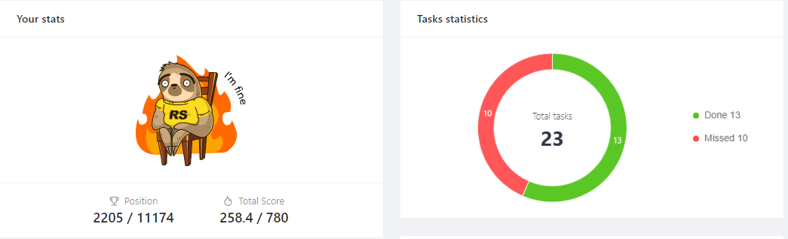

# __Maksim Chabanov__
---
# __Contacts__
#### __Address: Slutsk, Minsk region, Republic of Belarus__
#### __Phone: +37529 382-70-05__  
#### __Email: m4x.ch@yandex.by__ 
#### __GitHub: Maksim-Chabanov__ 
#### __Discord: [Maks.ch (@Maksim-Chabanov)]__
#### __Vkontakte:[Vkontakte](https://maksim-chabanov.github.io/rsschool-cv/cv)__

---

# __About me__
#### _I like to work in a team when like-minded people are united by the idea of creating something new. In the road industry, he worked in a team of five people. Therefore, I know firsthand about the importance of responsibility for my part of the work and the ability to find a common language with all team members, taking into account the nature of each, in order to achieve results._
---

# __Skills__
* #### __Version control: Git (remote service GitHub)__
* #### __HTML5__
* #### __CSS3__
* #### __VS Code__

---

# __Code Example:__
#### _An example of using a loop, the result of each iteration of which will be the display of the contents of the array._
```
const text = [t, e, x, t];  
for(let i; i < text.length; i++){  
    alert(text[i]);
}
```

---

# __Work experience__
#### _Taking the JavaScript Front-end Stage 0 course at RS School_
 
---

# __Education__ 
* #### St. petersburg state forestry Engineering University named after S. M. kirov
* #### Bobruisk State Forestry Technical College

---
# __English language__
* #### __A1(Elementary)__ 

